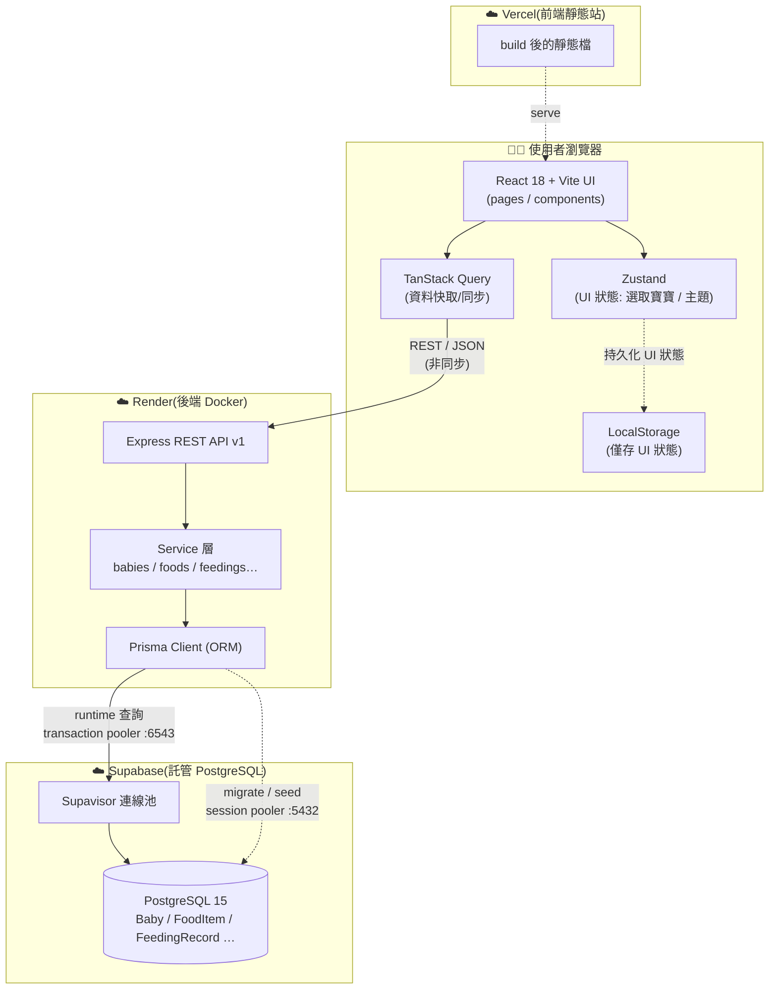
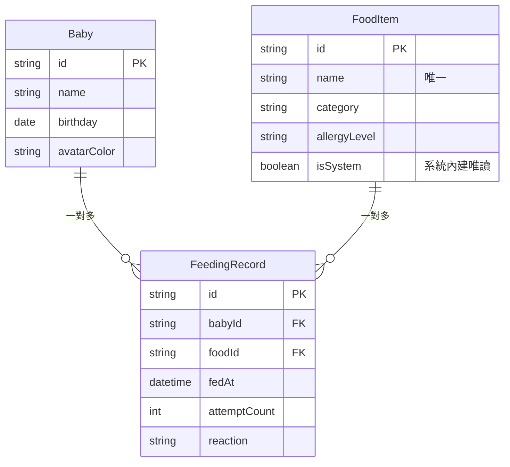

# 系統架構圖

> 搭配 [tech-share.md](./tech-share.md) / [tech-share-slides.md](./tech-share-slides.md) 使用。
> 下方提供 Mermaid（GitHub / VS Code 可直接渲染）與純文字 ASCII 兩版。

---

## 1. 整體架構（Mermaid）



**讀圖三個重點**

1. **解耦**:UI 不直接碰資料 → 一律走 `react-query → REST API → service → Prisma → DB`。換 DB(Render→Supabase)前端完全不動。
2. **LocalStorage 只存 UI 狀態**(選哪隻寶寶、佈景主題),領域資料一律在雲端 Postgres。
3. **兩條 DB 連線**:runtime 查詢走連線池(6543);migration/seed 走直連(5432,Prisma 引擎不支援經 pooler 跑)。

---

## 2. 純文字版(投影片 / 終端機用)

```text
┌─────────────────── 使用者瀏覽器 ───────────────────┐
│  React UI ──► TanStack Query ─┐                     │
│     │                          │ REST / JSON(非同步)│
│     └──► Zustand ──► LocalStorage(僅 UI 狀態)       │
└────────────────────────────────┼───────────────────┘
                                  │
                                  ▼
                    ┌──────── Render(Docker)────────┐
                    │  Express API v1                │
                    │     └► Service 層              │
                    │          └► Prisma (ORM)       │
                    └──────┬──────────────────┬──────┘
        runtime 查詢       │                  │  migrate / seed
        pooler :6543       ▼                  ▼  直連 :5432
                    ┌──────── Supabase ─────────────┐
                    │  Supavisor 連線池             │
                    │     └► PostgreSQL 15          │
                    │        Baby / FoodItem /      │
                    │        FeedingRecord …        │
                    └───────────────────────────────┘

前端部署:Vercel(靜態站)    後端部署:Render(Docker)
```

---

## 3. 資料模型(核心三表)



**規則重點**:刪寶寶 → 連帶刪其餵食紀錄;食物仍被引用則不可刪;同寶寶/食物/時間維持唯一鍵。
